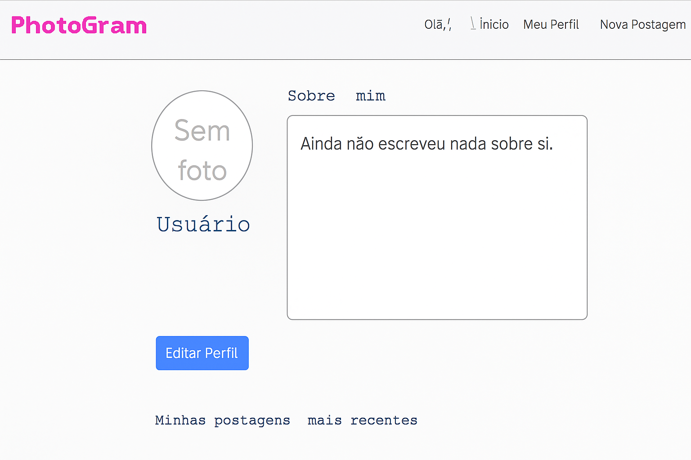

## 👤 Tela de Perfil de Outro Usuário

### Prototipo

### 📘 História de Usuário
> Como **usuário logado**, quero acessar a tela de perfil de outro usuário através da postagem criada por ele para visualizar suas informações públicas, fotos de perfil e últimos posts, de forma que eu possa conhecer melhor outros usuários da plataforma.

### ✅ Critérios de Aceite
- Exibir:
  - Foto do perfil do usuário (ou ícone padrão se não houver foto).  
  - Nome de usuário.  
  - Seção “Sobre mim” com descrição do usuário.  
  - Últimos 5 posts do usuário em formato de grid.  
- Cada post deve ser clicável, redirecionando para a tela de postagem individual.  
- Caso o usuário não tenha posts, exibir mensagem informativa.  
- Layout deve manter consistência visual com o restante da aplicação.

---

## 👤 Tela de Perfil do Próprio Usuário

### 📘 História de Usuário
> Como **usuário logado**, quero acessar minha própria tela de perfil para visualizar minhas informações, editar meus dados e atualizar minha foto de perfil por meio de uma modal, de forma prática e segura.

### ✅ Critérios de Aceite
- Exibir:
  - Foto do perfil (ou ícone padrão se não houver foto).  
  - Nome de usuário.  
  - Seção “Sobre mim” com descrição do usuário.  
  - Botão para **editar perfil**, que abre uma **modal de edição**.  
- Modal de edição deve permitir:
  - Atualizar nome de usuário.  
  - Atualizar descrição do “Sobre mim”.  
  - Alterar a foto de perfil (upload de imagem).  
- Alterações devem ser refletidas imediatamente na tela ao salvar.  
- Layout deve manter consistência visual com o restante da aplicação.